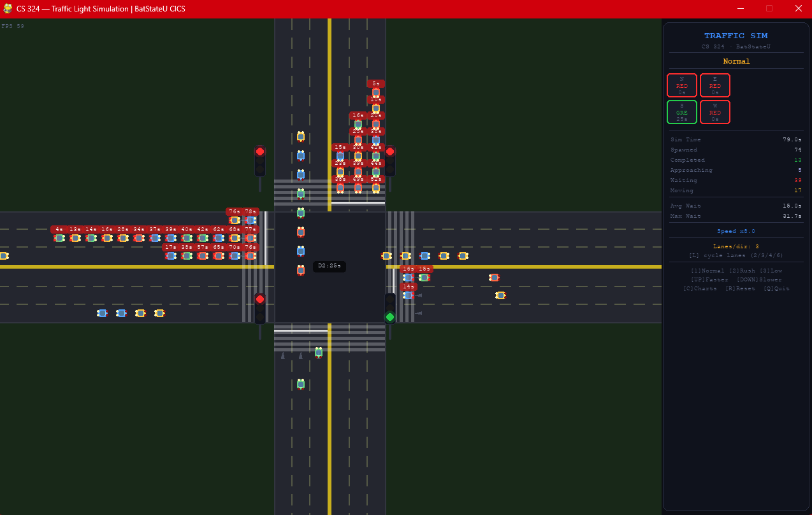
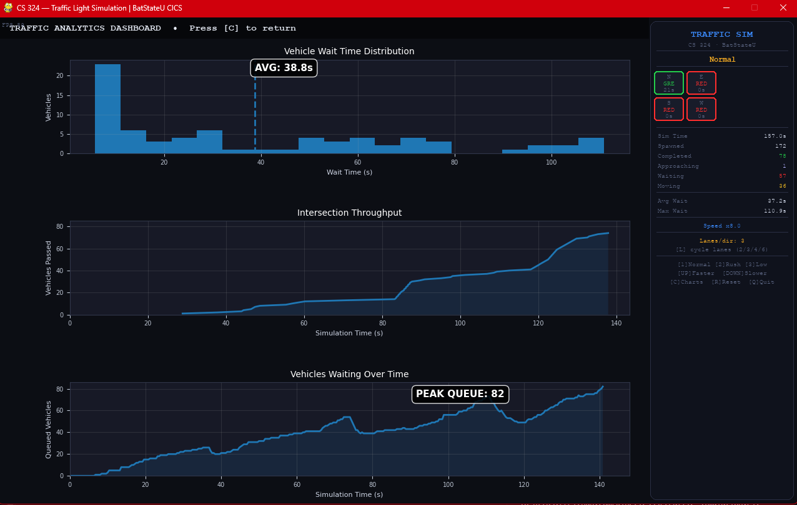
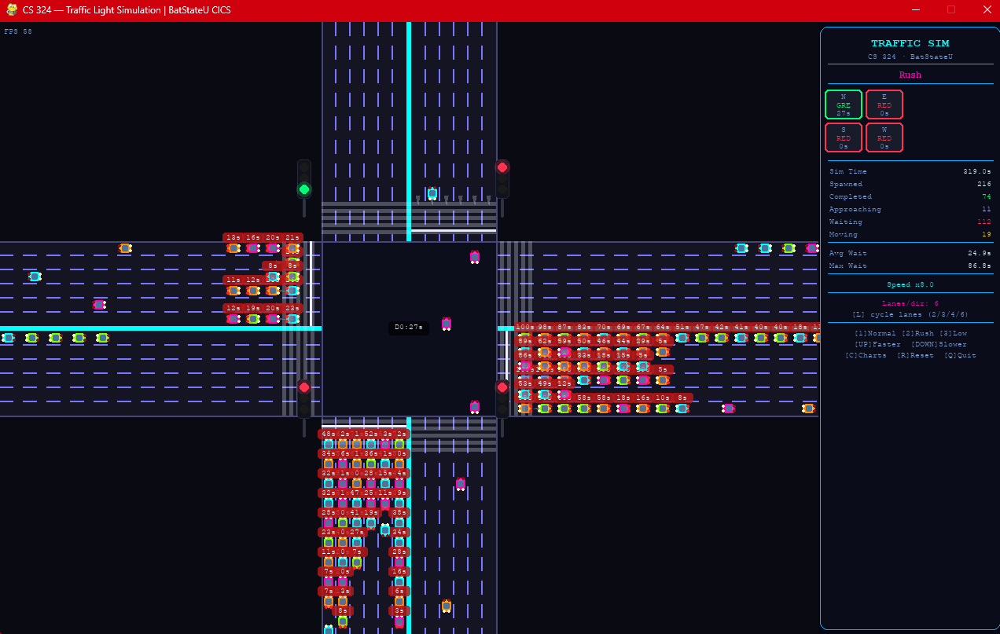

# 🚦 Traffic Light System Simulation
### CS 324 — Modeling and Simulation  
### Batangas State University — CICS

A real-time intelligent traffic intersection simulation built using **Python**, **SimPy**, and **Pygame**.

This project models a multi-lane traffic intersection with:
- Dynamic traffic light control
- Vehicle spawning and queuing
- Lane-based routing
- Turning behaviors
- Traffic congestion scenarios
- Real-time analytics dashboard
- Queue and throughput monitoring

---

# 📌 Features

## ✅ Traffic System Features
- 4-way intersection
- Multiple lane configurations:
  - 2 lanes
  - 3 lanes
  - 4 lanes
  - 6 lanes
- Realistic vehicle movement
- Vehicle queue management
- Traffic light phasing system
- Yellow and all-red clearance phases
- Left / Right / Straight vehicle routing
- No U-turn logic

---

## ✅ Simulation Features
- SimPy discrete-event simulation engine
- Real-time rendering using Pygame
- Adjustable simulation speed
- Resettable simulation state
- Dynamic congestion scenarios:
  - Normal Traffic
  - Rush Hour
  - Low Traffic

---

## ✅ Analytics Dashboard
- Wait time histogram
- Throughput graph
- Queue size graph
- Peak queue tracking
- Average wait time tracking
- CSV export of completed vehicles

---

# 🖥️ System Requirements

## Software Requirements
- Python 3.10 or newer

## Python Libraries
The project uses the following Python packages:

| Library | Purpose |
|---|---|
| pygame | Graphics and rendering |
| simpy | Discrete-event simulation |
| matplotlib | Charts and analytics |
| pandas | Data export and processing |

---

# 📦 Installation Guide

## STEP 1 — Install Python

Download and install Python:

https://www.python.org/downloads/

During installation:
- ✅ Check **"Add Python to PATH"**

Verify installation:

```bash
python --version
```

---

## STEP 2 — Download the Project

Clone the repository:

```bash
git clone <your-repository-url>
```

OR manually download the ZIP file and extract it.

---

## STEP 3 — Open the Project Folder

Open terminal or command prompt inside the project directory.

Example:

```bash
cd traffic-light-simulation
```

---

## STEP 4 — Install Required Libraries

Run:

```bash
pip install pygame simpy matplotlib pandas
```

---

# ▶️ Running the Simulation

Run the main Python file:

```bash
python traffic_simulation.py
```

The simulation window should open automatically.

---

# 🎮 Controls

| Key | Function |
|---|---|
| `1` | Normal Traffic |
| `2` | Rush Hour |
| `3` | Low Traffic |
| `UP` | Increase Simulation Speed |
| `DOWN` | Decrease Simulation Speed |
| `L` | Change Lane Count |
| `C` | Toggle Analytics Dashboard |
| `R` | Reset Simulation |
| `T` | Change Theme |
| `Q` | Quit Program |

---

# 🚗 Traffic Logic

## Vehicle Spawning
Vehicles spawn from all four directions:
- North
- East
- South
- West

Vehicles are randomly assigned:
- Left turn
- Right turn
- Straight movement

---

## Lane Assignment Logic

| Movement | Lane Used |
|---|---|
| Right Turn | Outermost Lane |
| Straight | Middle Lanes |
| Left Turn | Innermost Lane |

---

## Queueing System
- Vehicles stop at stop lines during red lights
- Queue spacing is pixel-based
- Vehicles follow the car ahead without overlap
- Vehicles release one-by-one during green signals

---

## Traffic Light Cycle

The system follows a rotating phase sequence:

```text
GREEN → YELLOW → ALL RED → NEXT DIRECTION
```

Only one direction is green at a time.

---

# 📊 Analytics Dashboard

Press:

```text
C
```

to open the analytics dashboard.

The dashboard displays:

## 1. Wait Time Distribution
Shows:
- Vehicle waiting times
- Average wait time

## 2. Throughput Graph
Shows:
- Vehicles completed over time

## 3. Queue Size Graph
Shows:
- Number of queued vehicles over time
- Peak queue size

---

# 📁 Output File

When the simulation closes, results are automatically exported:

```text
simulation_results.csv
```

The CSV contains:
- Vehicle ID
- Direction
- Lane
- Turn type
- Arrival time
- Wait time
- Departure time

---

# 🏗️ Project Structure

```text
traffic-light-simulation/
│
├── traffic_simulation.py
├── simulation_results.csv
└── README.md
```

---

# ⚙️ Core Technologies

| Technology | Usage |
|---|---|
| Python | Main programming language |
| SimPy | Event-driven simulation |
| Pygame | Visualization |
| Matplotlib | Charts |
| Pandas | CSV export |

---

# 🧠 Simulation Concepts Used

- Discrete Event Simulation
- Traffic Flow Modeling
- Queueing Systems
- State Machines
- Pathfinding
- Lane-based Routing
- Real-time Data Visualization

---

# 👨‍💻 Developers

| Name | Role |
| Kent Ian V. Ramirez | Backend Developer |

### Batangas State University — CICS
### CS 324 — Modeling and Simulation

Developed as part of the course requirements for simulation and systems modeling.

---

# 📜 License

This project is for educational purposes only.

---

# 📷 Screenshots

```markdown
## Main Simulation Window


---

## Analytics Dashboard


---

## Theme Change


```

---

# 🚀 Future Improvements

Possible future enhancements:
- Adaptive AI traffic lights
- Emergency vehicle priority
- Pedestrian crossings
- Collision detection
- Multi-intersection simulation
- Vehicle types (bus, truck, motorcycle)
- Weather effects
- Machine learning optimization

---

# 🛠️ Troubleshooting

## Problem: `ModuleNotFoundError`

Install missing libraries:

```bash
pip install pygame simpy matplotlib pandas
```

---

## Problem: Black screen or lag

Try:
- Lowering simulation speed
- Closing other applications
- Updating graphics drivers

---

## Problem: Charts not appearing

Ensure matplotlib backend is set:

```python
matplotlib.use("Agg")
```

---

# ✅ Successfully Running

If everything works correctly, you should see:
- A traffic intersection
- Moving vehicles
- Traffic lights
- Real-time analytics

Enjoy the simulation 🚦
